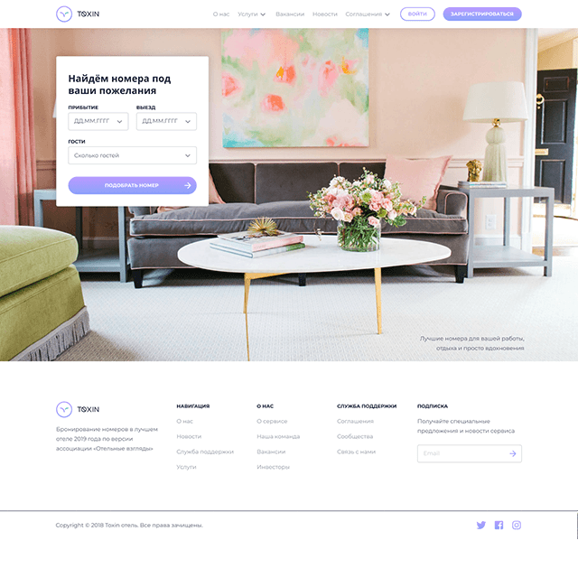

# ToxinHotel
**ToxinHotel** - site for Hotel with finding and reservation rooms (frontend part). This is pet project, that being part of [FSD](https://www.fullstack-development.com) education program (task №2). 

> Read more about of education program follow this link: www.fullstack-development.com/#system

> Read more about  of frontend education program tasks follow this link: [rizzoma.com](https://rizzoma.com/topic/d5c429337bcaa70548fb5aeedee6d92b)

## Technical details
 1. Site template look on: [Figma](https://www.figma.com/file/MumYcKVk9RkKZEG6dR5E3A/FSD-education-program.-The-2nd-task)
 2. Project bundler: [Webpack](https://webpack.js.org)
 3. Package manager: [NPM](https://npmjs.com)
 4. HTML template engine: [PUG](https://pugjs.org)
 5. CSS preprocessor: [SCSS](https://sass-lang.com)
 6. Javascript transpiler: [Babel](https://babeljs.io)
 7. Used [Jquery](https://www.npmjs.com/package/jquery) and next plugins:
    + [air-datepicker](https://www.npmjs.com/package/air-datepicker)
    + [flexslider](https://www.npmjs.com/package/flexslider)
    + [ion-rangeslider](https://www.npmjs.com/package/ion-rangeslider)        
    + [inputmask](https://www.npmjs.com/package/inputmask)
    + [item-quantity-dropdown](https://www.npmjs.com/package/item-quantity-dropdown)    
    + [px-jquery-pagination](https://www.npmjs.com/package/px-jquery-pagination)
 8. Browser support: Chrome and Firefox - two last version (specified in package.json)
    > **npx browserslist** - run this command  in project directory to see what browsers was selected

    > **npx browserslist --coverage** - check coverage for selected browsers
 9. Pages mark up is ["responsive"](http://www.liquidapsive.com), minimun width is 320 pixels, maximum width is 1440 pixels, page centered
## Watch result on github.io
   > Follow this link: https://wirwl.github.io/PetProjects/FSD/ToxinHotel

## Some usefull commands
  >**git clone https://github.com/wirwl/toxinhotel.git** - copy project from remote repository to local computer

  >**npm install** - install all dependencies

  >**npm run dev** - execute project with webpack-dev-server for development with live reloading

  >**npm run build** - build project with production mode

  >**npm run deploy** - deploy project on github.io

  >**npm run eslint** - check all files in project with [eslint](https://github.com/eslint/eslint)

  >**npm-check --skip-unused** - check what packages is out of date with [npm-check](https://www.npmjs.com/package/npm-check)

## Project demo (website pages)
